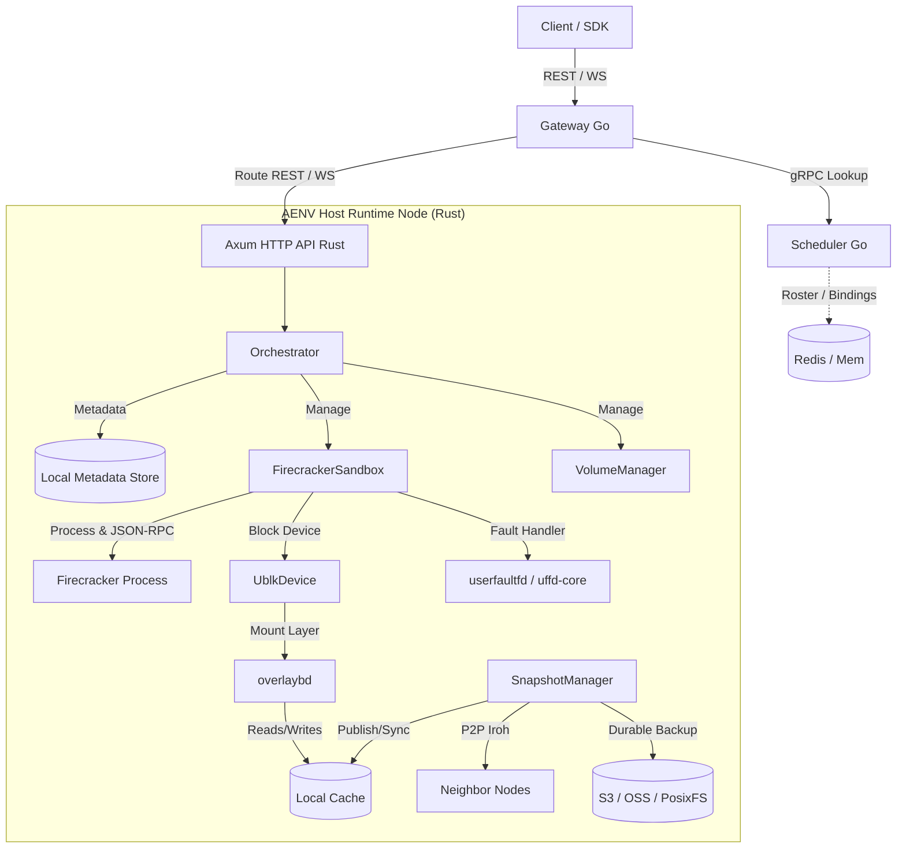

# AgentENV Architecture

This document describes the components of AgentENV, how they interact, and how data and requests flow through the system.

---

## High-Level Component Layout

AgentENV consists of two primary layers:
1. **The Core Runtime Node (Rust)**: Responsible for the local lifecycle of Firecracker microVMs, User-space Block Devices (ublk), OverlayBD virtual storage, and P2P snapshot sharing.
2. **The Distributed Control Plane (Go)**: Responsible for cluster-wide routing, scheduling, and high availability.

---

## Core System Components

### 1. The Distributed Control Plane (Go)
- **Distributed Gateway (`services/gateway`)**: A high-performance HTTP & WebSocket reverse proxy. It inspects incoming routing markers (headers like `x-agentenv-sandbox-id` or Host-based URLs like `{port}-{sandboxID}.{proxy_domain}`) to resolve which host node holds the sandbox and forwards the request.
- **Distributed Scheduler (`services/scheduler`)**: Exposes a gRPC API to track node heartbeats, registers active sandbox locations in a centralized Redis store, and implements scheduling strategies (e.g., Round Robin, Random) to assign new sandboxes to healthy host nodes.

### 2. Local Node Orchestrator (Rust)
- **API Server (`src/api`)**: Built on `axum`. Serves control plane REST requests and proxies data-plane traffic (such as terminal streams, secure `envd` channels, and file upload/download endpoints).
- **Orchestrator (`src/orchestrator`)**: The core coordinator of local state. It acts as a transaction manager for starting, pausing, resuming, and deleting sandboxes. It maintains active handles, cleans up leaked sandboxes, and coordinates image builds.
- **Volume Manager (`src/volume`)**: Handles lifecycle management of persistent extra storage drives (formatted as ext4 loop files) that can be dynamically mounted into sandboxes.

### 3. Sandbox Engine & Virtualization (Rust)
- **Firecracker Sandbox (`src/sandbox/firecracker`)**: Controls the individual microVM instances. It spawns the `firecracker` subprocess, sets up MMDS metadata, configures virtual interfaces, and talks to the Firecracker control API via UNIX domain sockets.
- **Network Manager (`src/sandbox/network`)**: Dynamically sets up host TAP interfaces, provisions unique MAC addresses, bridges networks, and enforces granular network egress firewall policies (such as internet blocking).

### 4. Storage & Memory Optimization (Rust & Storage Crate)
- **Ublk Device Manager (`storage/ublk`)**: A custom Rust integration with the Linux kernel's `ublk` (User-space Block Device) subsystem. It exports virtual block devices to Firecracker without copying data through the host page cache unnecessarily.
- **OverlayBD (`storage/overlaybd`)**: Exposes OCI container image layers and snapshot differences as virtual files, executing high-performance on-demand read/write and merge/compaction routines.
- **Userfaultfd Handler (`storage/uffd-core`)**: Powers fast resume by intercepting page faults in guest memory and fetching requested memory pages on demand. This allows virtual machines to resume running in under 50 ms before their entire memory footprint is fully restored from a snapshot.

### 5. Snapshot Distribution & Replication (Rust)
- **Snapshot Manager & Repository (`src/snapshot`)**: Saves and restores system snapshots.
- **Iroh P2P Transport (`src/p2p`)**: An embedded peer-to-peer engine built with `iroh`. Nodes discover one another and replicate snapshot memory/storage layers directly without requiring a central container registry to pre-warm every host.

---

## Key Data Flows

### Request-Routing & Sandbox Execution
1. **Client Launch**: A client requests `POST /sandboxes` at the **Gateway**.
2. **Scheduling**: The **Gateway** queries the **Scheduler** for a healthy node. The **Scheduler** registers a `sandbox_id -> node_id` binding and returns the target node's address.
3. **Local Provisioning**: The **Gateway** forwards the start request to the target **Runtime Node**.
4. **Local Launch**: The **Orchestrator** fetches the requested image layers, sets up a **UblkDevice** with **OverlayBD**, and boots a **Firecracker** instance.
5. **Data-Plane Proxying**: The **Gateway** proxies all subsequent WebSocket (envd) and HTTP requests directly to the target node's data proxy using the registered sandbox-to-node routing binding.
